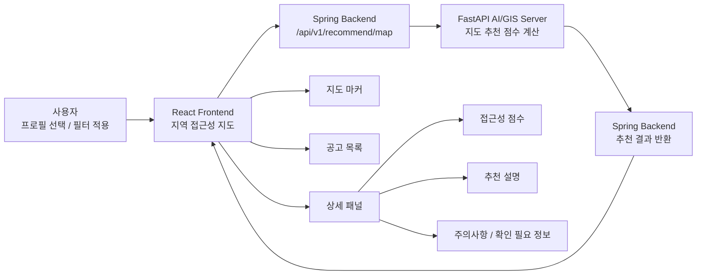

# BridgeWork Frontend

장애인 구직자가 **프로필 기반 일자리 추천**, **근무지 접근성 지도**, **추천 사유**, **스크랩 공고 관리**를 한 화면 흐름 안에서 확인할 수 있도록 만든 React 기반 웹 클라이언트입니다.

BridgeWork 전체 서비스에서 이 레포는 사용자가 직접 접하는 웹 애플리케이션 역할을 담당합니다. 프론트엔드는 인증, 프로필, 공고, 추천 요청을 Spring Backend로만 전달하며, FastAPI AI/GIS Server는 직접 호출하지 않습니다.

## 전체 구조

```text
React Frontend
  -> Nginx / Vercel Routing
  -> Spring Backend
  -> FastAPI AI/GIS Server
  -> PostgreSQL/PostGIS + Redis + OpenAI API
```

아래 표의 레포명을 클릭하면 각 GitHub 레포지토리로 이동합니다.

| 레포 | 역할 |
| --- | --- |
| [frontend](https://github.com/nodongservice/frontend) | React 웹 클라이언트, 소셜 로그인, 온보딩, 프로필, 추천/지도 화면 |
| [backend](https://github.com/nodongservice/backend) | Spring Boot API 서버, 인증/프로필/공공데이터 동기화, FastAPI 게이트웨이 |
| [aiserver](https://github.com/nodongservice/aiserver) | FastAPI AI/GIS 분석 서버, 스코어링, OCR/LLM 프로필 초안, 추천 설명 생성 |
| [backend-infra](https://github.com/nodongservice/backend-infra) | Nginx, Blue/Green 전환 스크립트, Prometheus/Grafana/Loki/Alloy 모니터링 |

## 핵심 기능

### 1. 홈과 공지사항

홈 화면은 현재 인기 공고와 공개 공지사항 요약을 제공합니다. 공지사항 목록과 상세 화면은 로그인하지 않은 사용자도 읽을 수 있고, 관리자 화면에서는 공지 생성/수정/삭제와 공개 여부, 상단 고정을 관리합니다.

- 현재 인기 공고 TOP 20 유지
- 공개 공지사항 목록/상세 조회
- 관리자 공지사항 CRUD
- 관리자 계정은 일반 사용자 기능 대신 관리자 공지 관리 화면으로 이동

### 2. 퀵 맞춤 일자리 추천

별도 퀵공고 페이지에서 사용자가 프로필을 선택하고 빠르게 추천 공고를 확인할 수 있는 기능입니다. 로그인 직후 백엔드 비동기 작업으로 첫 AI 추천 계산을 미리 시작합니다. AI 직무 적합도 토글을 켜면 선택한 프로필 기준으로 공고별 적합도와 추천 설명을 함께 보여주고, 토글을 끄면 최신 공고 중심으로 조회합니다.

- 프로필 선택 기반 추천 요청
- AI 직무 적합도 ON/OFF 토글
- 로그인 후 퀵 추천 사전 계산
- 추천 요청 상태 polling
- 계산 중 부분 결과 실시간 반영
- 상단 로딩바와 `불러오는 중 n/20` 진행률 표시
- AI ON: `20개 더 불러오기` 버튼으로 20개 단위 추가 계산, 최대 100개 표시
- AI OFF: 서버 페이지네이션 + 프론트 무한스크롤
- 추천 결과와 설명 캐싱
- 캐시된 추천 페이지는 최대 100개까지 즉시 반영
- 직무 적합도, 추천 이유, 주의사항, 추천 프로그램 표시
- 공고 스크랩 처리
- 로그인 전 사용자를 위한 안내 모달 제공

### 3. 지역 접근성 지도

근무지 주변 접근성 정보를 지도와 목록으로 함께 보여주는 화면입니다. 사용자는 필터 조건을 적용한 뒤 공고 위치, 접근성 점수, 이동 관련 참고 정보, 추천 설명을 확인할 수 있습니다.



- 네이버 지도 SDK 기반 지도 렌더링
- 회사 위치 마커와 지도 viewport 제어
- 접근성 등급 A/B/C 표시
- 근무지 주변 접근성 근거 표시
- 프로필 기반 종합 점수 계산 토글
- 추천 설명, 위험요소, 근거 항목 표시
- 지원기관/접근성 레이어 표시
- 지도 정보의 목록 대체 UI 제공
- AI ON: 20개 단위 계산, 부분 결과 실시간 반영, 상단 로딩바에 `불러오는 중 n/20` 진행률 표시
- AI ON: `20개 더 불러오기` 버튼으로 최대 100개까지 추가 조회
- AI OFF: 서버 페이지네이션 + 프론트 무한스크롤
- 캐시된 지도 추천 페이지는 최대 100개까지 즉시 반영

### 4. 온보딩과 프로필 관리

사용자가 추천에 필요한 정보를 단계적으로 입력하고, 이후 프로필 화면에서 여러 프로필을 관리할 수 있습니다. 프로필은 최대 3개까지 등록할 수 있으며 기본 프로필을 지정할 수 있습니다.

- 최초 가입 시 기본 프로필 생성 흐름
- 희망 직무, 경력, 학력, 자격, 근무조건 입력
- 장애 및 접근성 관련 선택 정보 입력
- 프로필 추가/수정/삭제
- 기본 프로필 설정
- 작성 중인 프로필 임시저장
- PDF 포트폴리오 업로드를 통한 프로필 초안 반영
- PDF 파일 확장자, MIME type, 크기 검증

### 5. 소셜 로그인과 인증 상태 관리

카카오/네이버 소셜 로그인 흐름을 제공하고, 로그인 이후 인증 토큰과 사용자 상태를 관리합니다.

- 카카오 OAuth callback 처리
- 네이버 OAuth callback 처리
- 네이버 OAuth `state` 생성/검증
- 액세스 토큰 기반 API 요청
- 인증이 필요한 화면 보호
- 로그아웃 및 가입 세션 정리
- 권한 부족 또는 인증 만료 시 안전한 리다이렉트
- 관리자 로그인과 관리자 전용 라우트 보호

### 6. 스크랩 공고 관리

사용자가 저장한 공고를 목록과 상세 패널에서 다시 확인하고 삭제할 수 있는 화면입니다.

- 스크랩 공고 목록 조회
- 공고 상세 정보 조회
- 스크랩 삭제 확인 모달
- 진행중/마감 공고 구분
- 로딩/에러/빈 데이터 상태 제공

### 7. SEO와 공개 페이지

서비스 소개, FAQ, 약관, 개인정보처리방침처럼 공개 가능한 페이지는 검색 노출을 고려하고, 인증이 필요한 화면은 색인되지 않도록 분리했습니다.

- locale 기반 라우팅: `ko`, `en`, `ja`, `zh-CN`
- 페이지별 title/description/robots meta 설정
- 빌드 시 `sitemap.xml`, `robots.txt` 생성
- 공개 정책 문서 route 색인 허용
- 추천/프로필/지도/설정 등 개인화 화면 색인 차단

## 프론트엔드 설계 원칙

- **Spring Backend 단일 진입점**: 프론트엔드는 FastAPI를 직접 호출하지 않고 Spring Backend만 호출합니다.
- **상태 기반 UI**: API 데이터 화면은 loading, error, empty, success 상태를 분리해 렌더링합니다.
- **접근성 중심 표현**: 색상만으로 상태를 전달하지 않고, 아이콘 버튼에는 `aria-label`을 제공합니다.
- **불확실성 보존**: 데이터가 부족한 항목은 “불가능”으로 단정하지 않고 “확인 필요”로 표현합니다.
- **지도 대체 정보 제공**: 지도 기반 정보는 목록과 상세 패널에서도 확인할 수 있도록 구성합니다.
- **민감정보 보호**: 클라이언트 환경변수에 secret, token, password 계열 값이 들어가지 않도록 빌드 설정에서 검사합니다.

## 주요 화면

| 화면 | 경로 | 설명 | 인증 |
| --- | --- | --- | --- |
| 메인 | `/:locale` | 인기 공고, 공지사항 요약 | 공개 |
| 퀵공고 | `/:locale/quick-jobs` | 퀵 맞춤 일자리 추천, 직무 적합도, 추천 설명 | 필요 |
| 서비스 소개 | `/:locale/about` | BridgeWork 소개 | 공개 |
| FAQ | `/:locale/faq` | 추천/접근성/개인정보 관련 안내 | 공개 |
| 공지사항 | `/:locale/notices`, `/:locale/notices/:noticeId` | 공개 공지사항 목록/상세 | 공개 |
| 관리자 로그인 | `/:locale/admin/login` | 관리자 계정 로그인 | 공개 |
| 관리자 공지 관리 | `/:locale/admin/notices` | 공지사항 생성/수정/삭제/공개 설정 | 관리자 |
| 회원가입 온보딩 | `/:locale/signup` | 최초 로그인 추가정보 입력 | 공개 |
| 스크랩 공고 | `/:locale/jobs` | 저장한 공고 목록/상세/삭제 | 필요 |
| 프로필 관리 | `/:locale/profile`, `/:locale/my/profile` | 프로필 추가/수정/삭제, PDF 초안 반영 | 필요 |
| 지역 접근성 지도 | `/:locale/accessibility-map` | 지도 기반 추천, 접근성 점수, 근거 확인 | 필요 |
| 설정 | `/:locale/settings` | 계정, 접근성 선호, 문의, 탈퇴 | 필요 |
| 정책 상세 | `/:locale/settings/policies/:policyId` | 약관/정책 상세 문서 | 공개 |
| 약관 | `/:locale/terms` | 이용약관 | 공개 |
| 개인정보처리방침 | `/:locale/privacy` | 개인정보처리방침 | 공개 |
| OAuth callback | `/auth/kakao/callback`, `/auth/naver/callback` | 소셜 로그인 callback | 공개 |

locale 없는 기존 경로는 기본 locale 경로로 리다이렉트됩니다. 기존 중국어 경로 `/zh`는 `/zh-CN`으로 정규화됩니다.

## 주요 API 연동

프론트엔드는 `src/api/httpClient.js`를 통해 Spring Backend API를 호출합니다.

| 모듈 | 주요 역할 |
| --- | --- |
| `authApi.js` | OAuth callback, 토큰 재발급, 로그아웃 |
| `profileApi.js` | 프로필 목록/상세/생성/수정/삭제, 기본 프로필 설정, PDF 프로필 초안 요청 |
| `postingApi.js` | 공고 상세, 스크랩 생성/삭제 |
| `recommendApi.js` | 퀵 추천, 지도 추천, 추천 task polling, 추천 설명 요청 |
| `mapApi.js` | 접근성 지도 보조 데이터 조회 |
| `optionsApi.js` | 온보딩/공고 필터 선택지 조회 |
| `noticeApi.js` | 공개 공지사항 조회, 관리자 공지사항 CRUD |

API 클라이언트 공통 처리:

- `REACT_APP_API_BASE_URL` 기준 요청
- `Authorization: Bearer ...` 헤더 설정
- `credentials: include` 사용
- 기본 30초 timeout
- GET 요청의 일부 408/429/5xx 응답 재시도
- 동일 요청 in-flight 재사용
- 사용자에게 노출 가능한 오류 메시지 정규화

추천 API 연동 규칙:

- Spring Backend의 `/recommend/quick`, `/recommend/map`만 호출하며 FastAPI를 직접 호출하지 않습니다.
- 응답이 `PROCESSING`이면 `/recommend/tasks/{requestId}`를 polling합니다.
- `PROCESSING` 상태에 부분 `result`가 포함되면 완료 전이라도 목록에 1개씩 반영합니다.
- 응답의 `cached=true` 또는 프론트 캐시에 페이지가 있으면 단계 로딩 없이 즉시 반영합니다.
- 퀵공고와 접근성지도는 AI ON에서 20개 단위, 최대 100개까지만 조회합니다.

## 기술 스택

| 영역 | 사용 기술 |
| --- | --- |
| UI | React 19, React DOM |
| Routing | React Router DOM 6 |
| Build | Vite 6 |
| 지도 | Naver Maps JavaScript SDK |
| 테스트 | Jest, Testing Library, jest-environment-jsdom |
| 품질 | Babel, Vite env validation, file upload validation |
| SEO | sitemap/robots 생성 스크립트, page metadata config |
| 배포 | Vercel SPA rewrite, security headers |

## 폴더 구조

```text
src/
  accessibility/        접근성/지도 관련 Context
  api/                  Spring Backend API 호출 함수
  app/                  라우터와 앱 단위 구성
  assets/               이미지 및 정적 에셋
  auth/                 인증 상태, 토큰 저장소, 권한 검사
  cache/                추천 결과와 설명 캐시
  components/           재사용 UI 컴포넌트
  config/               라우트, 환경설정, 정책/SEO 데이터
  hooks/                API 상태와 화면 로직
  i18n/                 locale, 번역 메시지
  pages/                라우팅 단위 페이지
  test/                 테스트용 mock
  utils/                공통 유틸리티
scripts/
  generate-seo-files.cjs  sitemap.xml, robots.txt 생성
public/                   정적 파일, manifest, OG 이미지
```

## 환경변수

클라이언트에 노출되는 환경변수는 `REACT_APP_*` 또는 대응되는 `VITE_*` 이름을 사용합니다. `vite.config.js`는 민감정보로 보이는 키워드가 포함된 클라이언트 환경변수를 차단합니다.

| 변수 | 설명 | 기본값 |
| --- | --- | --- |
| `REACT_APP_API_BASE_URL` | Spring Backend API base URL | 개발/테스트: `http://localhost:8080/api/v1`, 프로덕션: `https://api.bridgework.cloud/api/v1` |
| `REACT_APP_KAKAO_CLIENT_ID` | 카카오 OAuth Client ID | 없음 |
| `REACT_APP_KAKAO_REDIRECT_URI` | 카카오 OAuth Callback URI | 현재 origin + `/auth/kakao/callback` |
| `REACT_APP_NAVER_CLIENT_ID` | 네이버 OAuth Client ID | 없음 |
| `REACT_APP_NAVER_REDIRECT_URI` | 네이버 OAuth Callback URI | 현재 origin + `/auth/naver/callback` |
| `REACT_APP_NAVER_MAP_CLIENT_ID` | 네이버 지도 Client ID | 없음 |
| `REACT_APP_SITE_URL` | sitemap/robots 생성에 사용할 사이트 URL | `https://www.bridgework.cloud` |
| `REACT_APP_LOG_LEVEL` | 클라이언트 로그 레벨 | 없음 |
| `REACT_APP_WEB_VITALS_ENDPOINT` | Web Vitals 전송 endpoint | 없음 |

OAuth Client ID와 지도 Client ID는 브라우저에 노출되는 공개 클라이언트 값이어야 합니다. secret, private key, password, token, JWT, client secret, service key는 프론트엔드 환경변수에 넣지 않습니다.

## 실행

```bash
npm install
npm start
```

개발 서버는 `http://localhost:3000`에서 실행됩니다. `vite.config.js`에서 `strictPort: true`가 설정되어 있어 3000번 포트가 사용 중이면 실행에 실패합니다.

## 주요 명령어

| 명령어 | 설명 |
| --- | --- |
| `npm start` | Vite 개발 서버 실행 |
| `npm test` | Jest 테스트를 watch 모드 없이 1회 실행 |
| `npm run build` | SEO 파일 생성 후 프로덕션 빌드 생성 |

`npm run build` 실행 전 `prebuild` 스크립트가 동작해 `public/sitemap.xml`, `public/robots.txt`를 생성합니다. 빌드 결과물은 `build/`에 생성됩니다.

## 배포

이 레포는 Vercel 정적 배포와 SPA routing을 고려해 구성되어 있습니다.

- 설정 파일: `vercel.json`
- SPA fallback: 모든 경로를 `/index.html`로 rewrite
- 보안 헤더: CSP, `X-Content-Type-Options`, `Referrer-Policy`, `Permissions-Policy`, `X-Frame-Options`
- 빌드 산출물: `build/`

인증이 필요한 화면은 클라이언트 라우터에서 보호하고, API 권한 검증은 Spring Backend가 최종적으로 담당합니다.

## 접근성과 안전한 추천 표현

BridgeWork는 장애인 구직자를 위한 서비스이므로 추천 결과를 단정적으로 표현하지 않는 것을 중요한 UX 원칙으로 둡니다.

- 추천 점수와 설명은 지원 판단을 돕는 참고 정보로 표시합니다.
- 채용 합격, 직무 수행 가능성, 특정 이동 경로의 안전성을 보장하지 않습니다.
- 공공데이터가 부족한 경우 “확인 필요”로 안내합니다.
- 접근성 지도 정보는 실제 지원 전 사업장과 이동 경로를 다시 확인하도록 안내합니다.
- 민감한 장애/건강 관련 정보는 선택 입력 중심으로 다룹니다.

## 사업 아이템 차별점

- 단순 채용 공고 목록이 아니라, 장애인 구직자의 **직무 적합도**와 **출퇴근 접근성**을 함께 탐색하는 화면을 제공합니다.
- AI 추천을 켜고 끌 수 있어 최신 공고 조회와 프로필 기반 분석 흐름을 명확히 분리합니다.
- 지도, 목록, 상세 패널을 함께 제공해 지도 사용이 어려운 사용자도 정보를 확인할 수 있습니다.
- PDF 포트폴리오 기반 프로필 초안 생성으로 초기 입력 부담을 줄입니다.
- 추천 이유, 위험요소, 확인 필요 정보를 함께 보여줘 사용자가 결과를 맹신하지 않고 판단할 수 있도록 돕습니다.
- 공개 페이지와 개인화 페이지의 SEO/robots 정책을 분리해 서비스 소개와 개인정보 보호 요구를 함께 고려했습니다.
