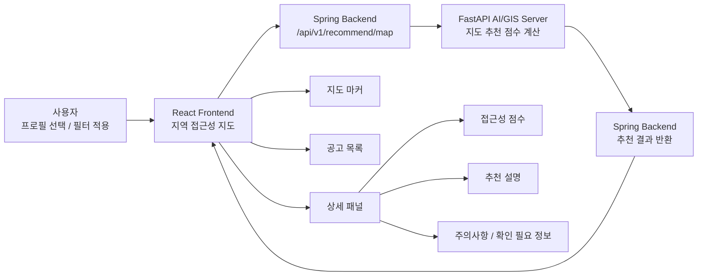

# BridgeWork Frontend

장애인 구직자가 **프로필 기반 일자리 추천**, **근무지 접근성 지도**, **추천 사유**, **스크랩 공고 관리**를 한 화면 흐름 안에서 확인할 수 있도록 만든 React 기반 웹 클라이언트입니다.

BridgeWork 전체 서비스에서 이 레포는 사용자가 직접 접하는 웹 애플리케이션 역할을 담당합니다. 프론트엔드는 인증, 프로필, 공고, 추천 요청을 Spring Backend로만 전달하며, FastAPI AI/GIS Server는 직접 호출하지 않습니다.

<p align="center">
  
</p>

## 전체 구조

```text
React Frontend on Vercel
  -> HTTPS API / Nginx
  -> Spring Backend
       ├─ PostgreSQL/PostGIS + Redis
       └─ FastAPI AI/GIS Server
            └─ OpenAI API
```

아래 표의 레포명을 클릭하면 각 GitHub 레포지토리로 이동합니다.

| 레포 | 역할 |
| --- | --- |
| [frontend](https://github.com/nodongservice/frontend) | React 웹 클라이언트, 소셜 로그인, 온보딩, 프로필, 추천/지도 화면 |
| [backend](https://github.com/nodongservice/backend) | Spring Boot API 서버, 인증/프로필/공공데이터 동기화, FastAPI 게이트웨이 |
| [aiserver](https://github.com/nodongservice/aiserver) | FastAPI AI/GIS 분석 서버, 스코어링, OCR/LLM 프로필 초안, 추천 설명 생성 |
| [backend-infra](https://github.com/nodongservice/backend-infra) | Nginx, Blue/Green 전환 스크립트, Prometheus/Grafana/Loki/Alloy 모니터링 |

## 팀

| 이름 | 담당 |
| --- | --- |
| 장혜진 | 기획 |
| 김수인 | 디자인 |
| 최성현 | 백엔드 및 인프라 |
| 박민정 | 프론트 및 AI 개발 |

## 핵심 기능

### 1. 홈과 공지사항

홈 화면은 현재 인기 공고, 공개 공지사항 요약, 취업에 도움이 되는 공공기관 링크를 제공합니다. 공지사항 목록과 상세 화면은 로그인하지 않은 사용자도 읽을 수 있고, 관리자 화면에서는 공지 생성/수정/삭제와 공개 여부, 상단 고정을 관리합니다.

- 현재 인기 공고 TOP 20 유지
- 공개 공지사항 목록/상세 조회
- 고용노동부, 한국장애인고용공단, 고용정보원 등 취업 지원기관 바로가기
- 관리자 공지사항 CRUD
- 관리자 계정은 일반 사용자 기능 대신 관리자 공지 관리 화면으로 이동

<p align="center">
  
</p>

### 2. 퀵 맞춤 일자리 추천

별도 퀵공고 페이지에서 사용자가 프로필을 선택하고 빠르게 추천 공고를 확인할 수 있는 기능입니다. AI 직무 적합도 토글을 켠 뒤 검색하면 선택한 프로필 기준으로 공고별 적합도와 추천 설명을 계산하고, 토글을 끄면 최신 공고 중심으로 조회합니다.

- 프로필 선택 기반 추천 요청
- AI 직무 적합도 ON/OFF 토글
- 검색 시점 퀵 추천 비동기 계산
- 추천 요청 상태 polling
- 계산 중 부분 결과 실시간 반영
- 상단 로딩바와 현재 계산 진행률 표시
- AI ON: 검색 시 현재 유효 공고 전체를 한 번에 계산 요청하고 부분 결과를 실시간 반영
- AI OFF: 서버 페이지네이션 + 프론트 무한스크롤
- 추천 결과와 설명 캐싱
- 캐시된 추천 결과는 첫 조회에서 즉시 반영
- 직무 적합도, 추천 이유, 주의사항, 추천 프로그램 표시
- 공고 스크랩 처리
- 로그인 전 사용자를 위한 안내 모달 제공

<p align="center">
  
</p>

<p align="center">
  
</p>

### 3. 지역 접근성 지도

근무지 주변 접근성 정보를 지도와 목록으로 함께 보여주는 화면입니다. 사용자는 필터 조건을 적용한 뒤 공고 위치, 접근성 점수, 이동 관련 참고 정보, 추천 설명을 확인할 수 있습니다.



- 네이버 지도 SDK 기반 지도 렌더링
- 회사 위치 마커와 지도 viewport 제어
- 접근성 등급 A/B/C 표시
- 근무지 주변 접근성 근거 표시
- 프로필 기반 종합 점수 계산 토글
- 추천 설명, 위험요소, 근거 항목 표시
- 지원기관/접근성 레이어 표시
- 지도 정보의 목록 대체 UI 제공
- AI ON: 현재 유효 공고 전체 계산, 부분 결과 실시간 반영, 상단 로딩바에 현재 계산 진행률 표시
- AI OFF: 서버 페이지네이션 + 프론트 무한스크롤
- 캐시된 지도 추천 결과는 첫 조회에서 즉시 반영

<p align="center">
  
</p>

<p align="center">
  
</p>

### 4. 온보딩과 프로필 관리

사용자가 추천에 필요한 정보를 단계적으로 입력하고, 이후 프로필 화면에서 여러 프로필을 관리할 수 있습니다. 프로필은 최대 3개까지 등록할 수 있으며 기본 프로필을 지정할 수 있습니다.

- 최초 가입 시 기본 프로필 생성 흐름
- 희망 직무, 경력, 학력, 자격, 근무조건 입력
- 장애 및 접근성 관련 선택 정보 입력
- 프로필 추가/수정/삭제
- 기본 프로필 설정
- 작성 중인 프로필 임시저장
- PDF 포트폴리오 업로드를 통한 프로필 초안 반영
- PDF 파일 확장자, MIME type, 크기 검증
- 저장된 프로필을 A4 PDF 이력서로 내보내기

<p align="center">
  
</p>

### 5. 소셜 로그인과 인증 상태 관리

카카오/네이버 소셜 로그인 흐름을 제공하고, 로그인 이후 인증 토큰과 사용자 상태를 관리합니다.

- 카카오 OAuth callback 처리
- 네이버 OAuth callback 처리
- 네이버 OAuth `state` 생성/검증
- 액세스 토큰 기반 API 요청
- 액세스 토큰은 메모리에만 유지하고 리프레시 토큰은 백엔드 `HttpOnly` 쿠키로만 관리
- 만료 1분 전 사전 갱신과 401 응답 후 1회 갱신/재시도
- 네트워크·429·5xx 갱신 실패 시 로컬 세션을 즉시 삭제하지 않음
- 인증이 필요한 화면 보호
- 로그아웃 및 가입 세션 정리
- 권한 부족 또는 인증 만료 시 안전한 리다이렉트
- 관리자 로그인과 관리자 전용 라우트 보호

### 6. 스크랩 공고 관리

사용자가 저장한 공고를 목록과 상세 패널에서 다시 확인하고 삭제할 수 있는 화면입니다.

- 스크랩 공고 목록 조회
- 공고 상세 정보 조회
- 스크랩 삭제 확인 모달
- 진행중/마감 공고 구분
- 로딩/에러/빈 데이터 상태 제공

### 7. SEO와 공개 페이지

서비스 소개, FAQ, 약관, 개인정보처리방침처럼 공개 가능한 페이지는 검색 노출을 고려하고, 인증이 필요한 화면은 색인되지 않도록 분리했습니다.

- locale 기반 라우팅: `ko`, `en`, `ja`, `zh-CN`
- 페이지별 title/description/robots meta 설정
- 빌드 시 `sitemap.xml`, `robots.txt` 생성
- 공개 정책 문서 route 색인 허용
- 추천/프로필/지도/설정 등 개인화 화면 색인 차단

### 8. 반응형 사용자 경험

데스크톱에서는 목록·지도·상세 패널을 동시에 제공하고, 좁은 화면에서는 기능 순서를 유지하면서 단일 열·하단 내비게이션 중심으로 재배치합니다.

- 데스크톱: 좌측 필터, 중앙 지도, 우측 상세 패널
- 태블릿: 지도 중심 배치와 축소 가능한 보조 패널
- 모바일: 하단 내비게이션, 단일 열 목록, 별도 필터·상세 흐름
- 모바일에서도 지도 범례와 텍스트 대체 안내 제공

<p align="center">
  
  
</p>

## 프론트엔드 설계 원칙

- **Spring Backend 단일 진입점**: 프론트엔드는 FastAPI를 직접 호출하지 않고 Spring Backend만 호출합니다.
- **상태 기반 UI**: API 데이터 화면은 loading, error, empty, success 상태를 분리해 렌더링합니다.
- **접근성 중심 표현**: 색상만으로 상태를 전달하지 않고, 아이콘 버튼에는 `aria-label`을 제공합니다.
- **불확실성 보존**: 데이터가 부족한 항목은 “불가능”으로 단정하지 않고 “확인 필요”로 표현합니다.
- **지도 대체 정보 제공**: 지도 기반 정보는 목록과 상세 패널에서도 확인할 수 있도록 구성합니다.
- **민감정보 보호**: 클라이언트 환경변수에 secret, token, password 계열 값이 들어가지 않도록 빌드 설정에서 검사합니다.

## 주요 화면

| 화면 | 경로 | 설명 | 인증 |
| --- | --- | --- | --- |
| 메인 | `/:locale` | 인기 공고, 공지사항 요약 | 공개 |
| 퀵공고 | `/:locale/quick-jobs` | 퀵 맞춤 일자리 추천, 직무 적합도, 추천 설명 | 필요 |
| 서비스 소개 | `/:locale/about` | BridgeWork 소개 | 공개 |
| FAQ | `/:locale/faq` | 추천/접근성/개인정보 관련 안내 | 공개 |
| 공지사항 | `/:locale/notices`, `/:locale/notices/:noticeId` | 공개 공지사항 목록/상세 | 공개 |
| 관리자 로그인 | `/:locale/admin/login` | 관리자 계정 로그인 | 공개 |
| 관리자 공지 관리 | `/:locale/admin/notices` | 공지사항 생성/수정/삭제/공개 설정 | 관리자 |
| 회원가입 온보딩 | `/:locale/signup` | 최초 로그인 추가정보 입력 | 공개 |
| 스크랩 공고 | `/:locale/jobs` | 저장한 공고 목록/상세/삭제 | 필요 |
| 프로필 관리 | `/:locale/profile`, `/:locale/my/profile` | 프로필 추가/수정/삭제, PDF 초안 반영 | 필요 |
| 프로필 PDF | `/:locale/profile/export/:profileId` | 저장된 프로필의 A4 PDF 내보내기 | 필요 |
| 지역 접근성 지도 | `/:locale/accessibility-map` | 지도 기반 추천, 접근성 점수, 근거 확인 | 필요 |
| 설정 | `/:locale/settings` | 계정, 접근성 선호, 문의, 탈퇴 | 필요 |
| 정책 상세 | `/:locale/settings/policies/:policyId` | 약관/정책 상세 문서 | 공개 |
| 약관 | `/:locale/terms` | 이용약관 | 공개 |
| 개인정보처리방침 | `/:locale/privacy` | 개인정보처리방침 | 공개 |
| OAuth callback | `/auth/kakao/callback`, `/auth/naver/callback` | 소셜 로그인 callback | 공개 |

locale 없는 기존 경로는 기본 locale 경로로 리다이렉트됩니다. 기존 중국어 경로 `/zh`는 `/zh-CN`으로 정규화됩니다.

## 기술 스택

| 영역 | 사용 기술 |
| --- | --- |
| UI | React 19, React DOM |
| Routing | React Router DOM 6 |
| Build | Vite 6 |
| 지도 | Naver Maps JavaScript SDK |
| 테스트 | Jest, Testing Library, jest-environment-jsdom |
| 품질 | Babel, Vite env validation, file upload validation |
| SEO | sitemap/robots 생성 스크립트, page metadata config |
| 배포 | Vercel SPA rewrite, security headers |
